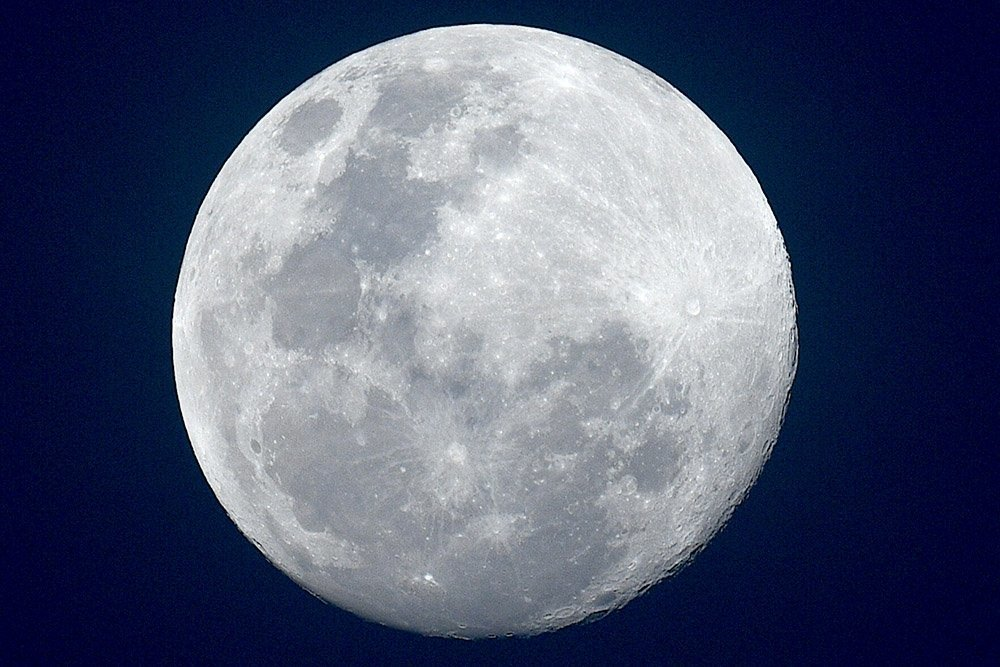

# Занимаемся создание разных веток
## Использование языка разметки MArkDown

Абзацы создаются при помощи пустой строки. Если вокруг текста сверху и снизу есть пустые строки, то текст превращается в абзац.

Чтобы сделать перенос строки вместо абзаца,  
нужно поставить два пробела в конце предыдущей строки.

Заголовки отмечаются диезом `#` в начале строки, от одного до шести. Например:

# Заголовок первого уровня #
## Заголовок h2
### Заголовок h3
#### Заголовок h4
##### Заголовок h5
###### Заголовок h6

Но, обязательно нужно поставить пробел, после решотки, а то ничего не изменится!

В декоративных целях заголовки можно «закрывать» с обратной стороны.

### Списки

Для разметки неупорядоченных списков можно использовать или `*`, или `-`, или `+`:

- элемент 1
- элемент 2
- элемент ...

Тоже самое:

+ элемент 1
+ элемент 2
+ элемент ...

Вложенные пункты создаются четырьмя пробелами перед маркером пункта:

* элемент 1
* элемент 2
    * вложенный элемент 2.1
    * вложенный элемент 2.2
* элемент ...

Упорядоченный список:

1. элемент 1
2. элемент 2
    1. вложенный
    2. вложенный
3. элемент 3
4. элемент 4

Цифру можно ипользовать любую, главное какой первый нумеруемый элемент и менно с этого элемента начнется список:

4. элемент 1
7. элемент 2
9. элемент 3
3. элемент 4

Список с абзацами:

* Раз абзац. Тут текст Тут текст Тут текст Тут текст Тут текст Тут текст Тут текст Тут текстТут текст

* Два абзац. Тут текстТут текстТут текстТут текстТут текстТут текстТут текстТут текстТут текстТут текстТут текстТут текстТут текстТут текстТут текстТут текстТут текстТут текстТут текст

* Три абзац. Тут текстТут текстТут текстТут текстТут текстТут текстТут текстТут текстТут текстТут текстТут текстТут текстТут текстТут текстТут текст

### Цитаты

Цитаты оформляются с помощью символа `>`.

> Грехи других судить вы так усердно рвётесь,
начните со своих и до чужих не доберётесь.

> Тогда лишь двое тайну соблюдают,
Когда один из них её не знает.

> Единственный естественный спутник Земли. Самый близкий к Солнцу спутник планеты, так как у ближайших к Солнцу планет их нет. Второй по яркости объект на земном небосводе после Солнца и пятый по величине естественный спутник планеты Солнечной системы. Среднее расстояние между центрами Земли и Луны - 384467 км

В цитаты можно помещать всё что угодно, в том числе вложенные цитаты:

> ## This is a header.
>
> 1.   Первая книга
> 2.   Вторая книга
>
> > Вложенная цитата. 

### Горизонтальная черта

`hr` создается тремя звездочками или тремя дефисами.

***

## Картинки

Картинка без `alt` текста

Картинка с альтом и тайтлом:

Запомнить просто: синтаксис как у ссылок, только перед открывающей квадратной скобкой ставится восклицательный знак.

## Пока это ВСЕ